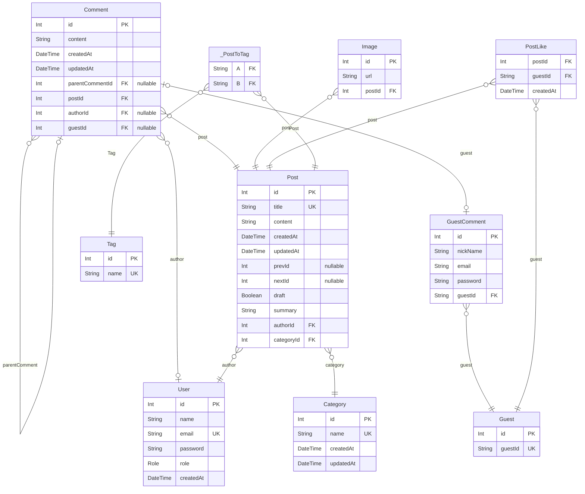

# 🌐 blog-backend

## 📌 프로젝트 소개

**기간: (2024.06 ~ .)**

#### 계기

단순히 설계와 구현에만 집중하고 있었다는 사실을 깨닫고,

지속적으로 **운영 및 유지 보수할 수 있는 프로젝트의 필요성**을 느꼈습니다.

#### 목표

1. 실제 서비스 운영에서 겪을 수 있는 문제들을 직접 경험해보고 해결할 수 있도록 합니다.
2. 지속적으로 코드 품질 개선합니다

## 📌 링크

#### 프로젝트 배포 주소

https://jongdeug.port0.org/

#### ⭐ Trouble Shooting 기록 ⭐

https://github.com/users/JongDeug/projects/9/views/3

#### 기능 개발 기록

https://github.com/users/JongDeug/projects/9/views/1

#### Swagger 배포 주소

https://jongdeug.port0.org/api/docs

## 📌 기술 스택

### v2

### v1

- **Express**: 학부 때 사용 경험 있음. 빠른 API 개발 가능.
- **NestJS**: 자유도가 높은 Express 대신 모듈화 방식 구조를 유도하는 NestJS로 마이그레이션. 코드 가독성과 유지보수성 향상 기대
- **Javascript**: 프론트엔드와 백엔드 모두 하나의 언어로 개발 가능
- **Typescript**: 코드의 안전성과 유지 보수 향상
- **Prisma**: TypeORM보다 직관적인 스키마 작성 가능, 좀 더 편리하게 데이터베이스 관리 및 쿼리 수행
- **MySQL**: 관계형 데이터베이스 설계 경험 축적 목적
- **Swagger**: 학부 팀 프로젝트에서 경험한 명확한 소통의 필요성에 따라 API 문서화 도구 적용

## 📌 아키텍처

#### 전체적인 서비스 구조

## 📌 API 명세서

| 구분             | 기능명                 | HTTP Method | REST API                                   | JWT | ROLE(하위 범주) |
| ---------------- | ---------------------- | ----------- | ------------------------------------------ | --- | --------------- |
| 1. 회원 관리     | 1.1 이메일 가입        | POST        | /auth/register                             | X   | ALL             |
|                  | 1.2 로그인             | POST        | /auth/login                                | X   | ALL             |
|                  | 1.3 로그아웃           | GET         | /auth/logout                               | O   | USER            |
|                  | 1.4 로그인 갱신        | GET         | /auth/token/refresh                        | O   | USER            |
|                  | 1.5 토큰 무효화        | GET         | /auth/token/revoke/:id                     | O   | ADMIN           |
|                  | 1.6 유저 목록 조회     | GET         | /user                                      | O   | ADMIN           |
|                  | 1.7 유저 상세 조회     | GET         | /user/:id                                  | O   | ADMIN           |
|                  | 1.8 유저 삭제          | DELETE      | /user/:id                                  | O   | ADMIN           |
| 2. 게시글 관리   | 2.1 게시글 목록 조회   | GET         | /post?search=&take=&draft=&cursor=&order[] | X   | ALL             |
|                  | 2.2 게시글 상세 조회   | GET         | /post/:id                                  | X   | ALL             |
|                  | 2.3 게시글 등록        | POST        | /post                                      | O   | ADMIN           |
|                  | 2.4 게시글 수정        | PATCH       | /post/:id                                  | O   | ADMIN           |
|                  | 2.5 게시글 삭제        | DELETE      | /post/:id                                  | O   | ADMIN           |
|                  | 2.6 게시글 좋아요      | POST        | /post/like/:id                             | X   | ALL             |
|                  | 2.7 이미지 업로드      | POST        | /common/image                              | O   | ADMIN           |
| 3. 댓글 관리     | 3.1 댓글 작성(회원)    | POST        | /post/comment/user                         | O   | USER            |
|                  | 3.2 댓글 수정(회원)    | PATCH       | /post/comment/user/:id                     | O   | USER            |
|                  | 3.3 댓글 삭제(회원)    | DELETE      | /post/comment/user/:id                     | O   | USER            |
|                  | 3.4 댓글 작성(비회원)  | POST        | /post/comment/guest                        | X   | ALL             |
|                  | 3.5 댓글 수정(비회원)  | PATCH       | /post/comment/guest/:id                    | X   | ALL             |
|                  | 3.6 댓글 삭제(비회원)  | DELETE      | /post/comment/guest/:id                    | X   | ALL             |
| 4. 태그 관리     | 4.1 태그 목록 조회     | GET         | /tag                                       | X   | ALL             |
|                  | 4.2 태그 상세 조회     | GET         | /tag/:id                                   | X   | ALL             |
|                  | 4.3 태그 생성          | POST        | /tag                                       | O   | ADMIN           |
|                  | 4.4 태그 수정          | PATCH       | /tag/:id                                   | O   | ADMIN           |
|                  | 4.5 태그 삭제          | DELETE      | /tag/:id                                   | O   | ADMIN           |
| 5. 카테고리 관리 | 5.1 카테고리 목록 조회 | GET         | /category                                  | X   | ALL             |
|                  | 5.2 카테고리 상세 조회 | GET         | /category/:id                              | X   | ALL             |
|                  | 5.3 카테고리 생성      | POST        | /category                                  | O   | ADMIN           |
|                  | 5.4 카테고리 수정      | PATCH       | /category/:id                              | O   | ADMIN           |
|                  | 5.5 카테고리 삭제      | DELETE      | /category/:id                              | O   | ADMIN           |

## 📌 시스템 최적화

### 1. 사용자 인증 시스템

### 📜 문제

JWT를 이용한 사용자 인증 시스템에서 여러 이슈 발생:

- Refresh Token을 서버 DB에 저장하는 이유에 대한 궁금증
- 클라이언트에게 JWT 토큰을 안전하게 전달하는 방법

### ⭐ 해결

**1. 토큰 무효화**

- 초기 구현: 서버 DB에 Refresh Token 저장 → 토큰 무효화 가능
- 개선: 캐시를 활용해 DB 접근없이 토큰 무효화가 가능하도록 변경 → 성능 최적화.

**2. 토큰 캐싱**

- 초기 구현: 요청마다 Access Token 토큰 검증
- 개선: Access Token을 캐싱해 검증된 유저 응답 시간 단축

**3. 토큰 전송 방식**

- 쿠키에 HttpOnly, SameSite, Secure 속성을 적용해 안전하게 전달.

### 🔥 성과

**1. 토큰 무효화**

- 탈취 위험에 대비 가능.

**2. 성능 개선**

- Access Token을 사용하는 API 응답 시간: **37ms → 7ms (약 81% 단축)**
- Refresh API 응답 시간: **95ms → 73ms (약 23% 단축)**
- Logout API 응답 시간: **90ms → 57ms (약 36% 단축)**

**3. 보안 강화**

- XSS, CSRF, Sniffing 공격 방어 가능.

---

### 2. 이미지 업로드 및 처리 개선

### 📜 문제

- 초기 구현: 게시글 Create API에 이미지 업로드 기능 포함
- 프론트엔드와 연결하는 과정에서 이미지 업로드 기능 개선 필요

### ⭐ 해결

**1. 이미지 업로드 API 독립적 분리**

**2. Nginx 도입**

- WAS(Wep Application Server)에 도달하기 전에 Nginx에서 정적 이미지 전달

**3. Task Scheduling 활용**

- 하루마다 업로드 된지 24시간이 지난 이미지 `temp` 폴더에서 삭제

### 🔥 성과

- 게시글 작성 API 응답 시간 **72.16ms → 22.96ms (약 68% 단축)**
- 게시글 작성 취소 및 페이지 이탈 시 발생하는 불필요한 이미지 문제 해결
- 이미지 로딩 속도 향상

---

### 3. 테스트 및 배포

**1. 테스트**

- 유닛 테스트, 통합 테스트, E2E 테스트 진행
- 코드의 신뢰성을 높이고 버그를 빠르게 발견

**2. Docker 사용**

- 라즈베리파이에서 따로 환경 세팅을 하지 않고도 서버 구동 가능
- Multi-state builds 빌드 적용 **697MB → 474MB (약 31% 절감)**

**3. CI/CD**

- Github Actions를 활용해 테스트, 빌드, 배포가 자동으로 이뤄지는 파이프라인 구축
- 코드 변경 사항을 자동으로 프로덕트 환경에 배포할 수 있어 편리

## 📌 ERD 설계

### `GuestComment`

비회원 댓글 테이블

**Properties**

- `id`: Primary Key
- `nickName`: 닉네임
- `email`: 이메일
- `password`: 비밀번호(해시값)
- `guestId`
  > Foreign Key
  >
  > 작성자(비회원) ID [Guest.guestId](#Guest)

### `Guest`

비회원 테이블

**Properties**

- `id`: Primary Key
- `guestId`: 비회원 id, 프론트에서 생성

### `Category`

카테고리 테이블

**Properties**

- `id`: Primary Key
- `name`: 카테고리 이름
- `createdAt`: 생성일
- `updatedAt`: 수정일

### `Comment`

댓글 테이블

**Properties**

- `id`: Primary Key
- `content`: 내용
- `createdAt`: 생성일
- `updatedAt`: 수정일
- `parentCommentId`
  > Foreign Key
  >
  > 부모 댓글 ID [Comment.id](#Comment)
- `postId`
  > Foreign Key
  >
  > 게시글 ID [Post.id](#Post)
- `authorId`
  > Foreign Key
  >
  > 작성자(회원) ID [User.id](#User)
- `guestId`
  > Foreign Key
  >
  > 작성자(비회원) ID [GuestComment.id](#GuestComment)

### `Image`

이미지 테이블

**Properties**

- `id`: Primary Key
- `url`: 이미지 url
- `postId`
  > Foreign Key
  >
  > 게시글 ID [Post.id](#Post)

### `PostLike`

비회원 <=> 게시글 : 다대다, 게시글 좋아요 테이블

**Properties**

- `postId`
  > Foreign Key
  >
  > 게시글 ID [Post.id](#Post)
- `guestId`
  > Foreign Key
  >
  > 비회원 ID [Guest.guestId](#Guest)
- `createdAt`: 좋아요가 눌린 날짜

### `Post`

게시글 테이블

**Properties**

- `id`: Primary Key
- `title`: 제목
- `content`: 내용
- `createdAt`: 생성일
- `updatedAt`: 수정일
- `prevId`: 이전 게시글 Id
- `nextId`: 다음 게시글 Id
- `draft`: 초안
- `summary`: 내용 요약
- `authorId`
  > Foreign Key
  >
  > 작성자 ID [User.id](#User)
- `categoryId`
  > Foreign Key
  >
  > 작성자 ID [Category.id](#Category)

### `Tag`

태그 테이블

**Properties**

- `id`: Primary Key
- `name`: 태그 이름

### `User`

회원 테이블

**Properties**

- `id`: Primary Key
- `name`: 이름
- `email`: 이메일
- `password`: 비밀번호(해시값)
- `role`: 역할
- `createdAt`: 생성일

### `_PostToTag`

Pair relationship table between [Post](#Post) and [Tag](#Tag)

**Properties**

- `A`:
- `B`:
