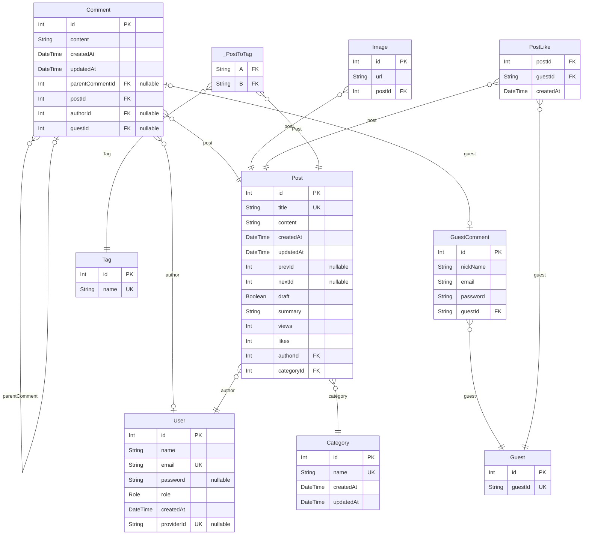

# 🌐 blog-backend

## 📌 1. 프로젝트 소개

**기간: (2024.06 ~ .)**

#### 프로젝트 주제 선정 배경

학부 시절 여러 팀 프로젝트를 진행했지만, 실질적으로 운영 및 유지 보수한 경험은 없었습니다.

다양한 아이디어를 고민한 끝에, 기능을 자유롭게 확장하고 수정하며 지속적으로 개선할 수 있는 블로그 서비스를 개발하는 것이 적절하다고 판단했습니다.

#### 과거 경험을 바탕으로 개선한 점

- **운영 및 유지 보수**
  - 사용자가 적더라도 실제 서비스 운영에서 겪을 수 있는 문제들을 직접 경험하고 개선할 수 있는 프로젝트 개발을 목표로 했습니다.
- **효율적인 커뮤니케이션**
  - 문제: 팀프로젝트에서 주로 구두로 협업을 진행했습니다.
  - 개선: GitHub Issue, PR 기능을 적극 활용했으며, API 문서화 도구를 도입했습니다.
- **테스트 코드**
  - 문제: 시연 중 갑작스러운 기능 오류로 인해 문제가 발생한 적이 있습니다.
  - 개선: 모든 주요 기능에 대해 테스트 코드를 작성했습니다.

#### 개발 주요사항

- **사용자 인증:** JWT, Google OAuth 2.0, RBAC(Role-Based Access Control)
- **CRUD 기능 구현:** 블로그 서비스 관련 API 개발 및 이미지 업로드 기능 추가
- **테스트 코드 작성:** Unit, Integration, E2E 테스트 코드 작성
- **프론트엔드 개발:** 서버 연동 및 SEO 최적화 적용
- **라즈베리파이 웹 서버 설정**

## 📌 2. 기술 스택

| **기술**       | **설명**                                                                                                                                 |
| -------------- | ---------------------------------------------------------------------------------------------------------------------------------------- |
| **TypeScript** | 하나의 언어로 백엔드와 프론트엔드를 개발 가능, 컴파일 타임에 의도치 않은 오류를 확인할 수 있어 유지 보수 용이                            |
| **NestJS**     | 자유도가 높은 Express 대신, 좀 더 구조적이고 계층화된 프레임워크로 마이그레이션, 코드 가독성과 유지 보수성 향상                          |
| **Next.js**    | 블로그 서비스 특성상 검색 엔진에 잘 노출되어야 하므로, SEO 최적화를 쉽게 할 수 있는 프레임워크 선택, 취업 시장에 맞춰 공부 목적으로 선택 |
| **MySQL**      | 관계형 데이터베이스 설계와 학습 목적                                                                                                     |
| **Prisma**     | TypeORM보다 직관적인 스키마 작성 가능, 좀 더 편리하게 데이터베이스 쿼리 수행 및 관리 가능                                                |

## 📌 2. 아키텍처

#### 전체적인 서비스 구조

## 📌 3. 프로젝트 링크

#### 프로젝트 배포 주소

https://jongdeug.ddns.net

#### ⭐ Trouble Shooting 기록 ⭐

https://github.com/users/JongDeug/projects/9/views/3

#### 기능 개발 기록

https://github.com/users/JongDeug/projects/9/views/1

#### Swagger 배포 주소

https://jongdeug.ddns.net/api/nest/docs

#### 프론트엔드 깃허브

https://github.com/JongDeug/blog-frontend

## 📌 5. API 명세서

| 구분             | 기능명                 | HTTP Method | REST API                                   | JWT | ROLE(하위 범주) |
| ---------------- | ---------------------- | ----------- | ------------------------------------------ | --- | --------------- |
| 1. 회원 관리     | 1.1 이메일 가입        | POST        | /auth/register                             | X   | ALL             |
|                  | 1.2 로그인             | POST        | /auth/login                                | X   | ALL             |
|                  | 1.3 로그아웃           | GET         | /auth/logout                               | O   | USER            |
|                  | 1.4 로그인 갱신        | GET         | /auth/token/refresh                        | O   | USER            |
|                  | 1.5 토큰 무효화        | GET         | /auth/token/revoke/:id                     | O   | ADMIN           |
|                  | 1.6 유저 목록 조회     | GET         | /user                                      | O   | ADMIN           |
|                  | 1.7 유저 상세 조회     | GET         | /user/:id                                  | O   | ADMIN           |
|                  | 1.8 유저 삭제          | DELETE      | /user/:id                                  | O   | ADMIN           |
| 2. 게시글 관리   | 2.1 게시글 목록 조회   | GET         | /post?search=&take=&draft=&cursor=&order[] | X   | ALL             |
|                  | 2.2 게시글 상세 조회   | GET         | /post/:id                                  | X   | ALL             |
|                  | 2.3 게시글 등록        | POST        | /post                                      | O   | ADMIN           |
|                  | 2.4 게시글 수정        | PATCH       | /post/:id                                  | O   | ADMIN           |
|                  | 2.5 게시글 삭제        | DELETE      | /post/:id                                  | O   | ADMIN           |
|                  | 2.6 게시글 좋아요      | POST        | /post/like/:id                             | X   | ALL             |
|                  | 2.7 이미지 업로드      | POST        | /common/image                              | O   | ADMIN           |
| 3. 댓글 관리     | 3.1 댓글 작성(회원)    | POST        | /post/comment/user                         | O   | USER            |
|                  | 3.2 댓글 수정(회원)    | PATCH       | /post/comment/user/:id                     | O   | USER            |
|                  | 3.3 댓글 삭제(회원)    | DELETE      | /post/comment/user/:id                     | O   | USER            |
|                  | 3.4 댓글 작성(비회원)  | POST        | /post/comment/guest                        | X   | ALL             |
|                  | 3.5 댓글 수정(비회원)  | PATCH       | /post/comment/guest/:id                    | X   | ALL             |
|                  | 3.6 댓글 삭제(비회원)  | DELETE      | /post/comment/guest/:id                    | X   | ALL             |
| 4. 태그 관리     | 4.1 태그 목록 조회     | GET         | /tag                                       | X   | ALL             |
|                  | 4.2 태그 상세 조회     | GET         | /tag/:id                                   | X   | ALL             |
|                  | 4.3 태그 생성          | POST        | /tag                                       | O   | ADMIN           |
|                  | 4.4 태그 수정          | PATCH       | /tag/:id                                   | O   | ADMIN           |
|                  | 4.5 태그 삭제          | DELETE      | /tag/:id                                   | O   | ADMIN           |
| 5. 카테고리 관리 | 5.1 카테고리 목록 조회 | GET         | /category                                  | X   | ALL             |
|                  | 5.2 카테고리 상세 조회 | GET         | /category/:id                              | X   | ALL             |
|                  | 5.3 카테고리 생성      | POST        | /category                                  | O   | ADMIN           |
|                  | 5.4 카테고리 수정      | PATCH       | /category/:id                              | O   | ADMIN           |
|                  | 5.5 카테고리 삭제      | DELETE      | /category/:id                              | O   | ADMIN           |

## 📌 6. ERD 설계

### `GuestComment`

비회원 댓글 테이블

**Properties**

- `id`: Primary Key
- `nickName`: 닉네임
- `email`: 이메일
- `password`: 비밀번호(해시값)
- `guestId`
  > Foreign Key
  >
  > 작성자(비회원) ID [Guest.guestId](#Guest)

### `Guest`

비회원 테이블

**Properties**

- `id`: Primary Key
- `guestId`: 비회원 id, 프론트에서 생성

### `Category`

카테고리 테이블

**Properties**

- `id`: Primary Key
- `name`: 카테고리 이름
- `createdAt`: 생성일
- `updatedAt`: 수정일

### `Comment`

댓글 테이블

**Properties**

- `id`: Primary Key
- `content`: 내용
- `createdAt`: 생성일
- `updatedAt`: 수정일
- `parentCommentId`
  > Foreign Key
  >
  > 부모 댓글 ID [Comment.id](#Comment)
- `postId`
  > Foreign Key
  >
  > 게시글 ID [Post.id](#Post)
- `authorId`
  > Foreign Key
  >
  > 작성자(회원) ID [User.id](#User)
- `guestId`
  > Foreign Key
  >
  > 작성자(비회원) ID [GuestComment.id](#GuestComment)

### `Image`

이미지 테이블

**Properties**

- `id`: Primary Key
- `url`: 이미지 url
- `postId`
  > Foreign Key
  >
  > 게시글 ID [Post.id](#Post)

### `PostLike`

비회원 <=> 게시글 : 다대다, 게시글 좋아요 테이블

**Properties**

- `postId`
  > Foreign Key
  >
  > 게시글 ID [Post.id](#Post)
- `guestId`
  > Foreign Key
  >
  > 비회원 ID [Guest.guestId](#Guest)
- `createdAt`: 좋아요가 눌린 날짜

### `Post`

게시글 테이블

**Properties**

- `id`: Primary Key
- `title`: 제목
- `content`: 내용
- `createdAt`: 생성일
- `updatedAt`: 수정일
- `prevId`: 이전 게시글 Id
- `nextId`: 다음 게시글 Id
- `draft`: 초안
- `summary`: 내용 요약
- `views`: 조회수
- `likes`: 좋아요수
- `authorId`
  > Foreign Key
  >
  > 작성자 ID [User.id](#User)
- `categoryId`
  > Foreign Key
  >
  > 작성자 ID [Category.id](#Category)

### `Tag`

태그 테이블

**Properties**

- `id`: Primary Key
- `name`: 태그 이름

### `User`

회원 테이블

**Properties**

- `id`: Primary Key
- `name`: 이름
- `email`: 이메일
- `password`: 비밀번호(해시값)
- `role`: 역할
- `createdAt`: 생성일
- `providerId`: OAuth Id

### `_PostToTag`

Pair relationship table between [Post](#Post) and [Tag](#Tag)

**Properties**

- `A`:
- `B`:
