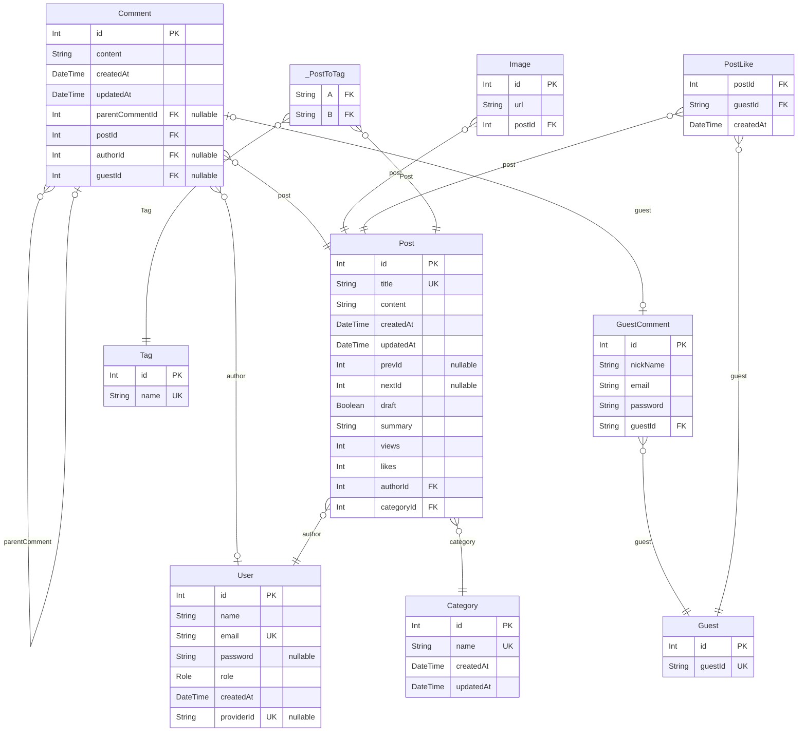

# 🌐 blog-backend

## 📌 1. 프로젝트 소개

#### 프로젝트 주제 선정 배경

학부 시절 여러 팀 프로젝트를 진행했지만, 실질적으로 운영 및 유지 보수한 경험은 없었습니다.

다양한 아이디어를 고민한 끝에, 기능을 자유롭게 확장하고 수정하며 **지속적으로 개선할 수 있는 블로그 서비스를 개발**하는 것이 적절하다고 판단했습니다.

#### 개발 주요사항

- **사용자 인증:** JWT, Google OAuth 2.0, RBAC(Role-Based Access Control)
- **CRUD 기능 구현:** 블로그 서비스 관련 API 개발 및 이미지 업로드 기능 추가
- **테스트 코드 작성:** Unit, Integration, E2E 테스트 코드 작성
- **프론트엔드 개발:** 서버 연동 및 SEO 최적화 적용
- **라즈베리파이 웹 서버 설정**

#### 프로젝트 관련 링크

- [프로젝트 배포 링크](https://jongdeug.ddns.net)
- [⭐Trouble Shooting 기록⭐](https://github.com/users/JongDeug/projects/9/views/3)
- [기능 개발 기록](https://github.com/users/JongDeug/projects/9/views/1)
- [Swagger 배포 주소](https://jongdeug.ddns.net/api/nest/docs)
- [프론트엔드 깃허브](https://github.com/JongDeug/blog-frontend)

## 📌 2. 기술 스택

## 📌 3. 아키텍처

#### 전체적인 서비스 구조

**애플리케이션 캐시 vs 분산 캐시**

단일 인스턴스로만 서비스를 진행하는 상황이므로 분산 캐시를 두는 것은 불필요하다고 판단해 애플리케이션 캐시를 이용했습니다.

## 📌 4. API 명세서

| 구분             | 기능명                        | HTTP Method | REST API                                   | JWT | ROLE(하위 범주) |
| ---------------- | ----------------------------- | ----------- | ------------------------------------------ | --- | --------------- |
| 1. 회원 관리     | 1.1 이메일 가입               | POST        | /auth/register                             | X   | ALL             |
|                  | 1.2 로그인                    | POST        | /auth/login                                | X   | ALL             |
|                  | 1.3 구글 OAuth 2.0 로그인     | GET         | /auth/to-google                            | X   | ALL             |
|                  | 1.4 구글 OAuth 2.0 리다이렉트 | GET         | /auth/google                               | X   | ALL             |
|                  | 1.5 로그아웃                  | GET         | /auth/logout                               | O   | USER            |
|                  | 1.6 로그인 갱신               | GET         | /auth/token/refresh                        | O   | USER            |
|                  | 1.7 토큰 무효화               | GET         | /auth/token/revoke/:id                     | O   | ADMIN           |
|                  | 1.8 유저 목록 조회            | GET         | /user                                      | O   | ADMIN           |
|                  | 1.9 유저 상세 조회            | GET         | /user/:id                                  | O   | ADMIN           |
|                  | 1.10 유저 삭제                | DELETE      | /user/:id                                  | O   | ADMIN           |
| 2. 게시글 관리   | 2.1 게시글 목록 조회          | GET         | /post?search=&take=&draft=&cursor=&order[] | X   | ALL             |
|                  | 2.2 게시글 상세 조회          | GET         | /post/:id                                  | X   | ALL             |
|                  | 2.3 게시글 등록               | POST        | /post                                      | O   | ADMIN           |
|                  | 2.4 게시글 수정               | PATCH       | /post/:id                                  | O   | ADMIN           |
|                  | 2.5 게시글 삭제               | DELETE      | /post/:id                                  | O   | ADMIN           |
|                  | 2.6 게시글 좋아요             | POST        | /post/like/:id                             | X   | ALL             |
|                  | 2.7 이미지 업로드             | POST        | /common/image                              | O   | ADMIN           |
| 3. 댓글 관리     | 3.1 댓글 작성(회원)           | POST        | /post/comment/user                         | O   | USER            |
|                  | 3.2 댓글 수정(회원)           | PATCH       | /post/comment/user/:id                     | O   | USER            |
|                  | 3.3 댓글 삭제(회원)           | DELETE      | /post/comment/user/:id                     | O   | USER            |
|                  | 3.4 댓글 작성(비회원)         | POST        | /post/comment/guest                        | X   | ALL             |
|                  | 3.5 댓글 수정(비회원)         | PATCH       | /post/comment/guest/:id                    | X   | ALL             |
|                  | 3.6 댓글 삭제(비회원)         | DELETE      | /post/comment/guest/:id                    | X   | ALL             |
| 4. 태그 관리     | 4.1 태그 목록 조회            | GET         | /tag                                       | X   | ALL             |
|                  | 4.2 태그 상세 조회            | GET         | /tag/:id                                   | X   | ALL             |
|                  | 4.3 태그 생성                 | POST        | /tag                                       | O   | ADMIN           |
|                  | 4.4 태그 수정                 | PATCH       | /tag/:id                                   | O   | ADMIN           |
|                  | 4.5 태그 삭제                 | DELETE      | /tag/:id                                   | O   | ADMIN           |
| 5. 카테고리 관리 | 5.1 카테고리 목록 조회        | GET         | /category                                  | X   | ALL             |
|                  | 5.2 카테고리 상세 조회        | GET         | /category/:id                              | X   | ALL             |
|                  | 5.3 카테고리 생성             | POST        | /category                                  | O   | ADMIN           |
|                  | 5.4 카테고리 수정             | PATCH       | /category/:id                              | O   | ADMIN           |
|                  | 5.5 카테고리 삭제             | DELETE      | /category/:id                              | O   | ADMIN           |

## 📌 6. ERD 설계

## 📌 7. UI
#### 메인 화면

#### 블로그 화면

#### rss 구독 화면

#### 로그인 화면

#### 검색 화면

#### 카테고리 관리 화면

#### 게시글 상세 화면

#### 게시글 작성 화면

#### 게시글 수정 화면

