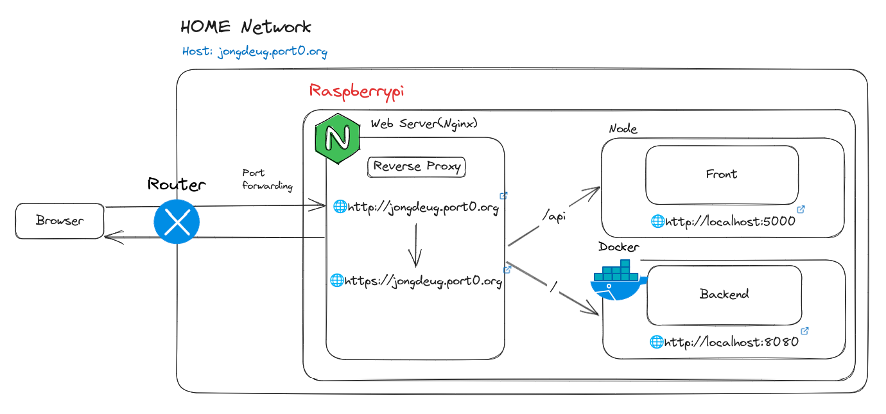
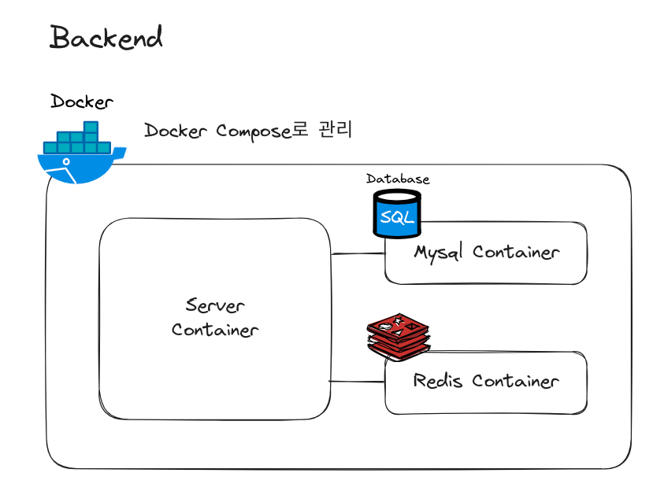
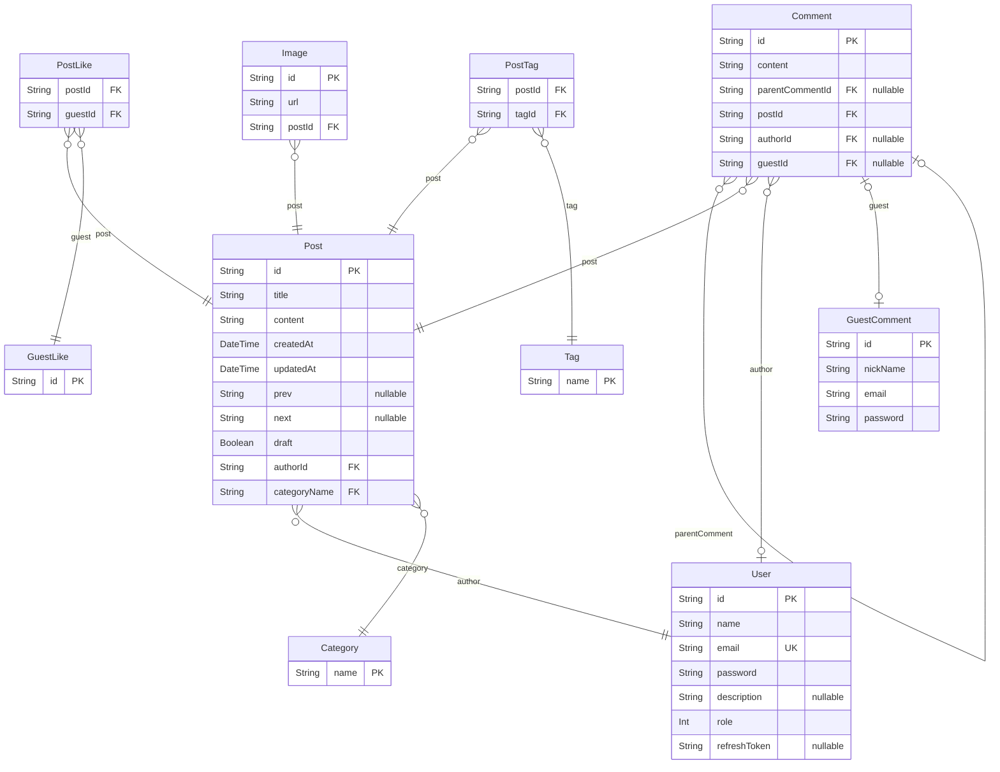

# 🌐 blog-backend

## 📌 프로젝트 소개

개인 블로그 운영(브랜딩)을 위한 백엔드 서버입니다. (2024.06 ~ .)

### 프로젝트를 진행하게된 계기

학부에서 다양한 주제로 여러 팀 프로젝트를 진행했지만, 지금까지 유지 보수 및 운영하고 있는 프로젝트가 없었습니다.

단순히 설계와 구현에만 집중하고 있다는 사실을 깨닫고, 전반적인 개발 과정을 모두 경험하면서, 지속적으로 운영 및 유지 보수할 수 있는 프로젝트가 필요했습니다.

### 프로젝트를 통한 목표

1. 실제 서비스 운영에서 겪을 수 있는 다양한 문제를 직접 해결하고 개선할 수 있도록 한다.
2. 지속적으로 코드 품질을 개선할 수 있도록 한다.
3. 위와 같은 활동을 통해 자연스럽게 포트폴리오 강화를 할 수 있도록 한다.
4. 개인 브랜딩을 통해 개인적 성장을 도모할 수 있도록 한다.

## 📌 기술 스택

## 📌 Swagger 배포 주소

- https://jongdeug.port0.org/api/docs
- username: admin
- password: 1234

## 📌 아키텍처

#### 전체적인 서비스 구조

#### 백엔드 구조

[//]: # (## 📌 기타 추가 사항들)

[//]: # (## 📌 화면 구성/API 주소)

## 📌 기능 리스트

| 구분        | 기능명             | 추가 기능              | 설명                                                    |
|-----------|-----------------|--------------------|-------------------------------------------------------|
| 1. 회원 관리  | ~~1.1 이메일 가입~~  |                    |                                                       |
|           | 1.2 로그인         |                    |                                                       |
|           | 1.3 인증 갱신       |                    | refreshToken 을 가지고 accessToken 와 refreshToken 을 갱신한다. |
|           | 1.4 로그아웃        |                    |                                                       |
| 2. 게시판 관리 | 2.1 게시글 목록 조회   | 2.1.1 게시글 검색       | 검색어를 포함하고 있는 게시글 목록을 볼 수 있다.                          |
|           |                 | 2.1.2 페이지네이션       | page, limit 변수를 기준으로 게시글 목록을 나눠서 보여주는 기능이다.           |
|           |                 | 2.1.3 카테고리별 검색     | 카테고리(폴더)별로 게시글을 목록을 확인할 수 있다.                         |
|           | 2.2 게시글 상세 조회   | 2.2.1 댓글 조회        | 게시글의 댓글을 조회할 수 있다.                                    |
|           | 2.3 게시글 등록      | 2.3.1 카테고리 및 태그 작성 |                                                       |
|           | 2.4 게시글 수정      |                    |                                                       |
|           | 2.5 게시글 삭제      |                    |                                                       |
|           | 2.6 카테고리 목록 조회  |                    |                                                       |
|           | 2.7 카테고리 생성     |                    |                                                       |
|           | 2.8 카테고리 수정     |                    |                                                       |
|           | 2.9 카테고리 삭제     |                    |                                                       |
|           | 2.10 게시글 좋아요    |                    |                                                       |
|           | 2.11 비회원 댓글 작성  |                    |                                                       |
|           | 2.12 비회원 대댓글 작성 |                    |                                                       |
|           | 2.13 비회원 댓글 수정  |                    |                                                       |
|           | 2.14 비회원 댓글 삭제  |                    |                                                       |
|           | 2.15 댓글 작성      |                    |                                                       |
|           | 2.16 대댓글 작성     |                    |                                                       |
|           | 2.17 댓글 수정      |                    |                                                       |
|           | 2.18 댓글 삭제      |                    |                                                       |
|           | 2.19 이미지 업로드    |                    |                                                       |

## 📌 설계 명세서

### ⚡ API 명세서

| 구분        | 기능명             | HTTP Method | REST API                              | JWT   |
|-----------|-----------------|-------------|---------------------------------------|-------|
| 1. 회원 관리  | ~~1.1 이메일 가입~~  | ~~POST~~    | ~~/auth/register~~                    | ~~X~~ |
|           | 1.2 로그인         | POST        | /auth/login                           | X     |
|           | 1.3 로그인 갱신      | GET         | /auth/refresh                         | O     |
|           | 1.4 로그아웃        | GET         | /auth/logout                          | O     |
| 2. 게시글 관리 | 2.1 게시글 목록 조회   | GET         | /posts?search=&page=&limit=&category= | X     |
|           | 2.2 게시글 상세 조회   | GET         | /posts/:id?guestLikeId=               | X     |
|           | 2.3 게시글 등록      | POST        | /posts                                | O     |
|           | 2.4 게시글 수정      | PATCH       | /posts/:id                            | O     |
|           | 2.5 게시글 삭제      | DELETE      | /posts/:id                            | O     |
|           | 2.6 카테고리 목록 조회  | GET         | /categories                           | X     |
|           | 2.7 카테고리 생성     | POST        | /categories                           | O     |
|           | 2.8 카테고리 수정     | PATCH       | /categories/:name                     | O     |
|           | 2.9 카테고리 삭제     | DELETE      | /categories/:name                     | O     |
|           | 2.10 게시글 좋아요    | POST        | /posts/like                           | X     |
|           | 2.11 비회원 댓글 작성  | POST        | /posts/comments/guest                 | X     |
|           | 2.12 비회원 대댓글 작성 | POST        | /posts/child-comments/guest           | X     |
|           | 2.13 비회원 댓글 수정  | PATCH       | /posts/comments/guest/:id             | X     |
|           | 2.14 비회원 댓글 삭제  | DELETE      | /posts/comments/guest/:id             | X     |
|           | 2.15 댓글 작성      | POST        | /posts/comments                       | O     |
|           | 2.16 대댓글 작성     | POST        | /posts/child-comments                 | O     |
|           | 2.17 댓글 수정      | PATCH       | /posts/comments/:id                   | O     |
|           | 2.18 댓글 삭제      | DELETE      | /posts/comments/:id                   | O     |
|           | 2.19 이미지 업로드    | POST        | /posts/upload                         | O     |

### ⚡ ERD 설계

# 블로그 프로젝트 ERD

> Generated by [`prisma-markdown`](https://github.com/samchon/prisma-markdown)

- [Blog](#blog)

## Blog

### `User`

회원 테이블

**Properties**

- `id`: Pirmary Key
- `name`: 이름
- `email`: 이메일
- `password`: 비밀번호
- `description`: 간단한 소개
- `role`: 역할
- `refreshToken`: refresh token

### `GuestLike`

비회원 좋아요 테이블

**Properties**

- `id`: Pirmary Key

### `GuestComment`

비회원 댓글 테이블

**Properties**

- `id`: Pirmary Key
- `nickName`: 닉네임
- `email`: 이메일
- `password`: 비밀번호

### `PostLike`

비회원 <=> 게시글 : 다대다, 게시글 좋아요 테이블

**Properties**

- `postId`
  > Foreign Key
  >
  > 게시글 ID [Post.id](#Post)
- `guestId`
  > Foreign Key
  >
  > 비회원 ID [GuestLike.id](#GuestLike)

### `Post`

게시글 테이블

**Properties**

- `id`: Pirmary Key
- `title`: 제목
- `content`: 내용
- `createdAt`: 생성일
- `updatedAt`: 수정일
- `prev`: 이전 게시글 id
- `next`: 다음 게시글 id
- `draft`: 초안
- `authorId`
  > Foreign Key
  >
  > 작성자 ID [User.id](#User)
- `categoryName`
  > Foreign Key
  >
  > 작성자 ID [Category.id](#Category)

### `Tag`

태그 테이블

**Properties**

- `name`: Primary Key, 태그 이름

### `PostTag`

포스트, 태그 다대다 테이블

**Properties**

- `postId`
  > Foreign Key
  >
  > 게시글 ID [Post.id](#Post)
- `tagId`
  > Foreign Key
  >
  > 태그 ID [Tag.id](#Tag)

### `Image`

이미지 테이블

**Properties**

- `id`: Pirmary Key
- `url`: 이미지 url
- `postId`
  > Foreign Key
  >
  > 게시글 ID [Post.id](#Post)

### `Category`

카테고리 테이블

**Properties**

- `name`: Primary Key, 카테고리 이름

### `Comment`

댓글 테이블

**Properties**

- `id`: Pirmary Key
- `content`: 내용
- `parentCommentId`
  > Foreign Key
  >
  > 부모 댓글 ID [Comment.id](#Comment)
- `postId`
  > Foreign Key
  >
  > 게시글 ID [Post.id](#Post)
- `authorId`
  > Foreign Key
  >
  > 작성자(회원) ID [User.id](#User)
- `guestId`
  > Foreign Key
  >
  > 작성자(비회원) ID [GuestComment.id](#GuestComment)
