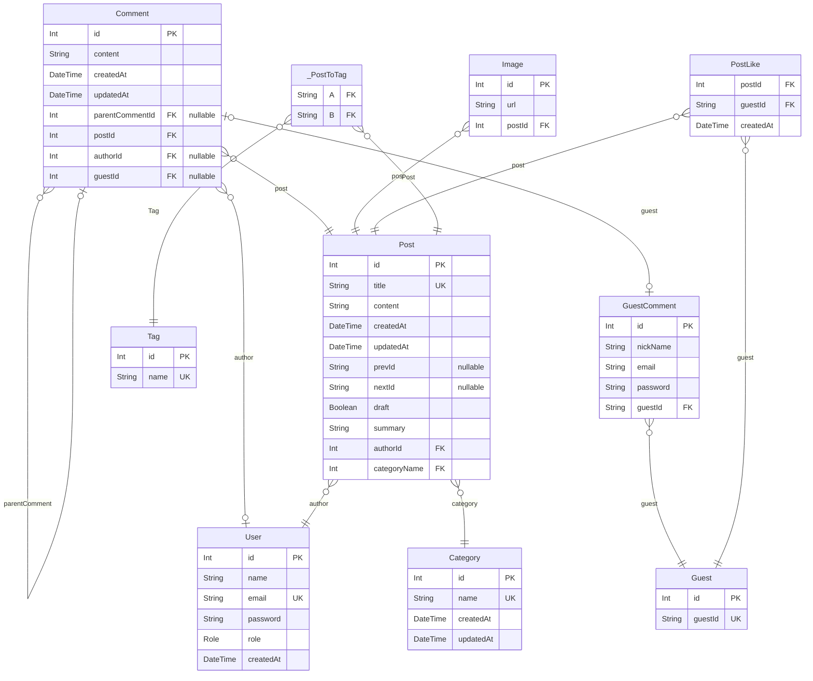

# 🌐 blog-backend

## 📌 프로젝트 소개

개인 블로그 운영(브랜딩)을 위한 백엔드 서버입니다. (2024.06 ~ .)

### 프로젝트를 진행4. **유연성:** Refresh 토큰을 통해 사용자의 세션을 더 세밀하게 제어할 수 있습니다.

하게된 계기

학부에서 다양한 주제로 여러 팀 프로젝트를 진행했지만, 지금까지 유지 보수 및 운영하고 있는 프로젝트가 없었습니다.

단순히 설계와 구현에만 집중하고 있다는 사실을 깨닫고, 전반적인 개발 과정을 모두 경험하면서, 지속적으로 운영 및 유지 보수할 수 있는 프로젝트가 필요했습니다.

### 프로젝트를 통한 목표

1. 실제 서비스 운영에서 겪을 수 있는 다양한 문제를 직접 해결하고 개선할 수 있도록 한다.
2. 지속적으로 코드 품질을 개선할 수 있도록 한다.
3. 위와 같은 활동을 통해 자연스럽게 포트폴리오 강화를 할 수 있도록 한다.
4. 개인 브랜딩을 통해 개인적 성장을 도모할 수 있도록 한다.

## 📌 기술 스택

## 📌 Swagger 배포 주소

- https://jongdeug.port0.org/api/docs
- username: admin
- password: 1234

## 📌 아키텍처

#### 전체적인 서비스 구조

#### 백엔드 구조

[//]: # '## 📌 기타 추가 사항들'
[//]: # '## 📌 화면 구성/API 주소'

## 📌 설계 명세서

### ⚡ API 명세서

| 구분           | 기능명                  | HTTP Method | REST API                                   | JWT | ROLE(하위 범주) |
| -------------- | ----------------------- | ----------- | ------------------------------------------ | --- | --------------- |
| 1. 회원 관리   | 1.1 이메일 가입         | POST        | /auth/register                             | X   | .               |
|                | 1.2 로그인              | POST        | /auth/login                                | X   | .               |
|                | 1.3 로그아웃            | GET         | /auth/logout                               | O   | USER            |
|                | 1.4 로그인 갱신         | GET         | /auth/token/refresh                        | O   | USER            |
|                | 1.5 토큰 무효화         | GET         | /auth/token/revoke/:id                     | O   | ADMIN           |
|                | 1.6 유저 목록 조회      | GET         | /user                                      | O   | ADMIN           |
|                | 1.7 유저 상세 조회      | GET         | /user/:id                                  | O   | ADMIN           |
|                | 1.8 유저 삭제           | DELETE      | /user/:id                                  | O   | ADMIN           |
| 2. 게시글 관리 | 2.1 게시글 목록 조회    | GET         | /post?search=&take=&draft=&cursor=&order[] | X   | .               |
|                | 2.2 게시글 상세 조회    | GET         | /post/:id                                  | X   | .               |
|                | 2.3 게시글 등록         | POST        | /post                                      | O   | ADMIN           |
|                | 2.4 게시글 수정         | PATCH       | /post/:id                                  | O   | ADMIN           |
|                | 2.5 게시글 삭제         | DELETE      | /post/:id                                  | O   | ADMIN           |
|                | 2.6 게시글 좋아요       | POST        | /post/like/:id                             | X   | .               |
|                | 2.7 이미지 업로드       | POST        | /common/image                              | O   | ADMIN           |
|                | 2.8 태그 목록 조회      | GET         | /tag                                       | X   | .               |
|                | 2.9 태그 상세 조회      | GET         | /tag/:id                                   | X   | .               |
|                | 2.10 태그 생성          | POST        | /tag                                       | O   | ADMIN           |
|                | 2.11 태그 수정          | PATCH       | /tag/:id                                   | O   | ADMIN           |
|                | 2.12 태그 삭제          | DELETE      | /tag/:id                                   | O   | ADMIN           |
|                | 2.13 카테고리 목록 조회 | GET         | /category                                  | X   | .               |
|                | 2.14 카테고리 상세 조회 | GET         | /category/:id                              | X   | .               |
|                | 2.15 카테고리 생성      | POST        | /category                                  | O   | ADMIN           |
|                | 2.16 카테고리 수정      | PATCH       | /category/:id                              | O   | ADMIN           |
|                | 2.17 카테고리 삭제      | DELETE      | /category/:id                              | O   | ADMIN           |
|                | 2.18 댓글 작성(회원)    | POST        | /post/comment/user                         | O   | USER            |
|                | 2.19 댓글 수정(회원)    | PATCH       | /post/comment/user/:id                     | O   | USER            |
|                | 2.20 댓글 삭제(회원)    | DELETE      | /post/comment/user/:id                     | O   | USER            |
|                | 2.21 댓글 작성(비회원)  | POST        | /post/comment/guest                        | X   | .               |
|                | 2.22 댓글 수정(비회원)  | PATCH       | /post/comment/guest/:id                    | X   | .               |
|                | 2.23 댓글 삭제(비회원)  | DELETE      | /post/comment/guest/:id                    | X   | .               |

### ⚡ ERD 설계

# Blog Project ERD

> Generated by [`prisma-markdown`](https://github.com/samchon/prisma-markdown)

- [Blog](#blog)

## Blog

### `GuestComment`

비회원 댓글 테이블

**Properties**

- `id`: Pirmary Key
- `nickName`: 닉네임
- `email`: 이메일
- `password`: 비밀번호(해시값)
- `guestId`
  > Foreign Key
  >
  > 작성자(비회원) ID [Guest.guestId](#Guest)

### `Guest`

비회원 테이블

**Properties**

- `id`: Pirmary Key
- `guestId`: 비회원 id, 프론트에서 생성

### `Category`

카테고리 테이블

**Properties**

- `id`: Pirmary Key
- `name`: 카테고리 이름
- `createdAt`: 생성일
- `updatedAt`: 수정일

### `Comment`

댓글 테이블

**Properties**

- `id`: Pirmary Key
- `content`: 내용
- `createdAt`: 생성일
- `updatedAt`: 수정일
- `parentCommentId`
  > Foreign Key
  >
  > 부모 댓글 ID [Comment.id](#Comment)
- `postId`
  > Foreign Key
  >
  > 게시글 ID [Post.id](#Post)
- `authorId`
  > Foreign Key
  >
  > 작성자(회원) ID [User.id](#User)
- `guestId`
  > Foreign Key
  >
  > 작성자(비회원) ID [GuestComment.id](#GuestComment)

### `Image`

이미지 테이블

**Properties**

- `id`: Pirmary Key
- `url`: 이미지 url
- `postId`
  > Foreign Key
  >
  > 게시글 ID [Post.id](#Post)

### `PostLike`

비회원 <=> 게시글 : 다대다, 게시글 좋아요 테이블

**Properties**

- `postId`
  > Foreign Key
  >
  > 게시글 ID [Post.id](#Post)
- `guestId`
  > Foreign Key
  >
  > 비회원 ID [Guest.guestId](#Guest)
- `createdAt`: 좋아요가 눌린 날짜

### `Post`

게시글 테이블

**Properties**

- `id`: Pirmary Key
- `title`: 제목
- `content`: 내용
- `createdAt`: 생성일
- `updatedAt`: 수정일
- `prevId`: 이전 게시글 Id
- `nextId`: 다음 게시글 Id
- `draft`: 초안
- `summary`: 내용 요약
- `authorId`
  > Foreign Key
  >
  > 작성자 ID [User.id](#User)
- `categoryName`
  > Foreign Key
  >
  > 작성자 ID [Category.id](#Category)

### `Tag`

태그 테이블

**Properties**

- `id`: Pirmary Key
- `name`: 태그 이름

### `User`

회원 테이블

**Properties**

- `id`: Pirmary Key
- `name`: 이름
- `email`: 이메일
- `password`: 비밀번호(해시값)
- `role`: 역할
- `createdAt`: 생성일

### `_PostToTag`

Pair relationship table between [Post](#Post) and [Tag](#Tag)

**Properties**

- `A`:
- `B`:
