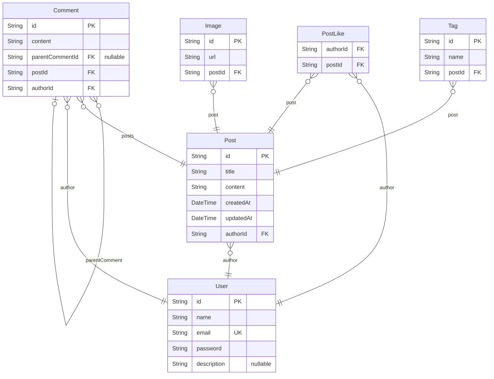

# 게시판 프로젝트 ERD
> Generated by [`prisma-markdown`](https://github.com/samchon/prisma-markdown)

- [Board](#board)

## Board

### `User`
Both description and ERD on Actors chatper.

Also, only ERD on Articles and Orders chapters.

**Properties**
  - `id`: 
  - `name`: 
  - `email`: 
  - `password`: 
  - `description`: 

### `Post`
Only description on Actors chapter.

**Properties**
  - `id`: 
  - `title`: 
  - `content`: 
  - `createdAt`: 
  - `updatedAt`: 
  - `authorId`: 

### `Comment`

**Properties**
  - `id`: 
  - `content`: 
  - `parentCommentId`: 
  - `postId`: 
  - `authorId`: 

### `PostLike`

**Properties**
  - `authorId`: 
  - `postId`: 

### `Tag`

**Properties**
  - `id`: 
  - `name`: 
  - `postId`: 

### `Image`

**Properties**
  - `id`: 
  - `url`: 
  - `postId`: 