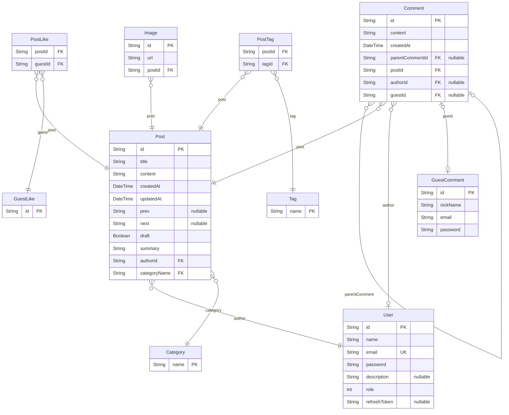

# 블로그 프로젝트 ERD
> Generated by [`prisma-markdown`](https://github.com/samchon/prisma-markdown)

- [Blog](#blog)

## Blog

### `User`
회원 테이블

**Properties**
  - `id`: Pirmary Key
  - `name`: 이름
  - `email`: 이메일
  - `password`: 비밀번호
  - `description`: 간단한 소개
  - `role`: 역할
  - `refreshToken`: refresh token

### `GuestLike`
비회원 좋아요 테이블

**Properties**
  - `id`: Pirmary Key

### `GuestComment`
비회원 댓글 테이블

**Properties**
  - `id`: Pirmary Key
  - `nickName`: 닉네임
  - `email`: 이메일
  - `password`: 비밀번호

### `PostLike`
비회원 <=> 게시글 : 다대다, 게시글 좋아요 테이블

**Properties**
  - `postId`
    > Foreign Key
    > 
    > 게시글 ID [Post.id](#Post)
  - `guestId`
    > Foreign Key
    > 
    > 비회원 ID [GuestLike.id](#GuestLike)

### `Post`
게시글 테이블

**Properties**
  - `id`: Pirmary Key
  - `title`: 제목
  - `content`: 내용
  - `createdAt`: 생성일
  - `updatedAt`: 수정일
  - `prev`: 이전 게시글 id
  - `next`: 다음 게시글 id
  - `draft`: 초안
  - `summary`: 내용 요약
  - `authorId`
    > Foreign Key
    > 
    > 작성자 ID [User.id](#User)
  - `categoryName`
    > Foreign Key
    > 
    > 작성자 ID [Category.id](#Category)

### `Tag`
태그 테이블

**Properties**
  - `name`: Primary Key, 태그 이름

### `PostTag`
포스트, 태그 다대다 테이블

**Properties**
  - `postId`
    > Foreign Key
    > 
    > 게시글 ID [Post.id](#Post)
  - `tagId`
    > Foreign Key
    > 
    > 태그 ID [Tag.id](#Tag)

### `Image`
이미지 테이블

**Properties**
  - `id`: Pirmary Key
  - `url`: 이미지 url
  - `postId`
    > Foreign Key
    > 
    > 게시글 ID [Post.id](#Post)

### `Category`
카테고리 테이블

**Properties**
  - `name`: Primary Key, 카테고리 이름

### `Comment`
댓글 테이블

**Properties**
  - `id`: Pirmary Key
  - `content`: 내용
  - `createdAt`: 생성일
  - `parentCommentId`
    > Foreign Key
    > 
    > 부모 댓글 ID [Comment.id](#Comment)
  - `postId`
    > Foreign Key
    > 
    > 게시글 ID [Post.id](#Post)
  - `authorId`
    > Foreign Key
    > 
    > 작성자(회원) ID [User.id](#User)
  - `guestId`
    > Foreign Key
    > 
    > 작성자(비회원) ID [GuestComment.id](#GuestComment)