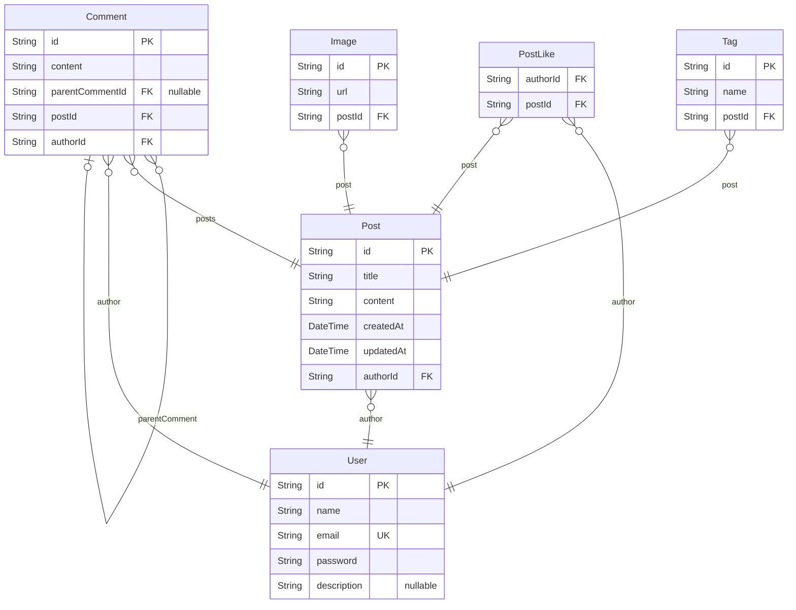

# 게시판 프로젝트 ERD
> Generated by [`prisma-markdown`](https://github.com/samchon/prisma-markdown)

- [Board](#board)

## Board

### `User`
회원 테이블

**Properties**
  - `id`: Pirmary Key
  - `name`: 이름
  - `email`: 이메일 
  - `password`: 비밀번호
  - `description`: 간단한 소개

### `Post`
게시글 테이블

**Properties**
  - `id`: Pirmary Key
  - `title`: 제목
  - `content`: 내용
  - `createdAt`: 생성일
  - `updatedAt`: 수정일
  - `authorId`
    > Foreign Key
    > 
    > 작성자 ID [User.id](#User)

### `Comment`
댓글 테이블

**Properties**
  - `id`: Pirmary Key
  - `content`: 내용
  - `parentCommentId`
    > Foreign Key
    > 
    > 부모 댓글 ID [Comment.id](#Comment)
  - `postId`
    > Foreign Key
    > 
    > 게시글 ID [Post.id](#Post)
  - `authorId`
    > Foreign Key
    > 
    > 작성자 ID [User.id](#User)

### `PostLike`
게시글 좋아요 테이블

**Properties**
  - `authorId`
    > Foreign Key
    > 
    > 작성자 ID
  - `postId`
    > Foreign Key
    > 
    > 게시글 ID [Post.id](#Post)

### `Tag`
게시글 태그 테이블

**Properties**
  - `id`: Primary Key
  - `name`: 태그 이름
  - `postId`
    > Foreign Key
    > 
    > 게시글 ID [Post.id](#Post)

### `Image`
게시글 이미지 테이블

**Properties**
  - `id`: Pirmary Key
  - `url`: 이미지 url
  - `postId`
    > Foreign Key
    > 
    > 게시글 ID [Post.id](#Post)