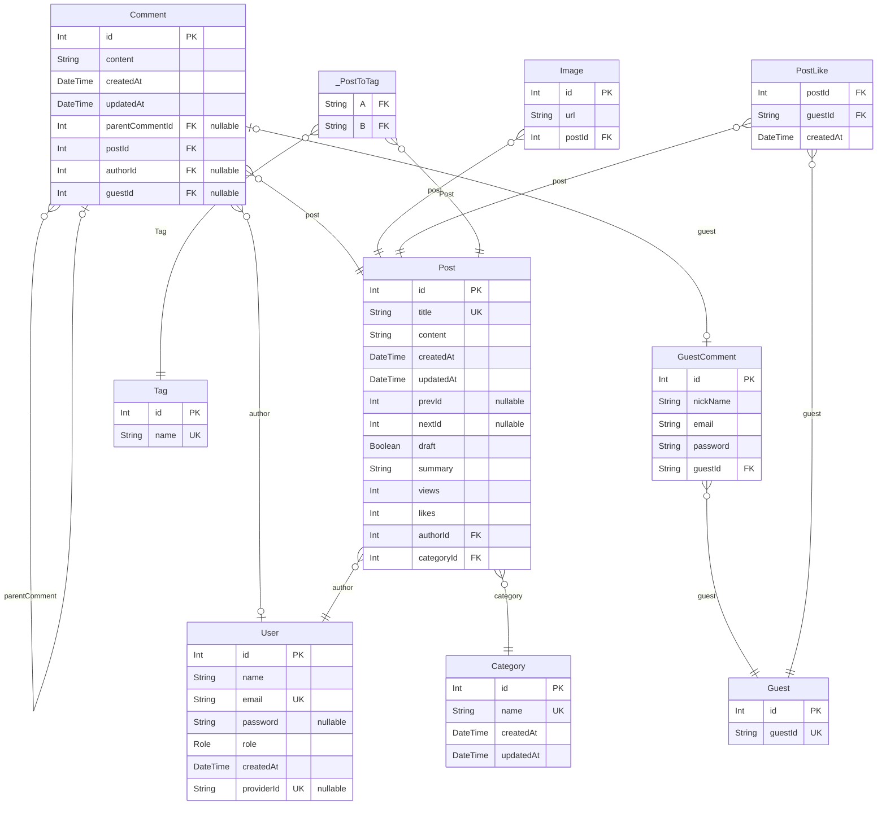

# Blog Project ERD
> Generated by [`prisma-markdown`](https://github.com/samchon/prisma-markdown)

- [Blog](#blog)

## Blog

### `GuestComment`
비회원 댓글 테이블

**Properties**
  - `id`: Primary Key
  - `nickName`: 닉네임
  - `email`: 이메일
  - `password`: 비밀번호(해시값)
  - `guestId`
    > Foreign Key
    > 
    > 작성자(비회원) ID [Guest.guestId](#Guest)

### `Guest`
비회원 테이블

**Properties**
  - `id`: Primary Key
  - `guestId`: 비회원 id, 프론트에서 생성

### `Category`
카테고리 테이블

**Properties**
  - `id`: Primary Key
  - `name`: 카테고리 이름
  - `createdAt`: 생성일
  - `updatedAt`: 수정일

### `Comment`
댓글 테이블

**Properties**
  - `id`: Primary Key
  - `content`: 내용
  - `createdAt`: 생성일
  - `updatedAt`: 수정일
  - `parentCommentId`
    > Foreign Key
    > 
    > 부모 댓글 ID [Comment.id](#Comment)
  - `postId`
    > Foreign Key
    > 
    > 게시글 ID [Post.id](#Post)
  - `authorId`
    > Foreign Key
    > 
    > 작성자(회원) ID [User.id](#User)
  - `guestId`
    > Foreign Key
    > 
    > 작성자(비회원) ID [GuestComment.id](#GuestComment)

### `Image`
이미지 테이블

**Properties**
  - `id`: Primary Key
  - `url`: 이미지 url
  - `postId`
    > Foreign Key
    > 
    > 게시글 ID [Post.id](#Post)

### `PostLike`
비회원 <=> 게시글 : 다대다, 게시글 좋아요 테이블

**Properties**
  - `postId`
    > Foreign Key
    > 
    > 게시글 ID [Post.id](#Post)
  - `guestId`
    > Foreign Key
    > 
    > 비회원 ID [Guest.guestId](#Guest)
  - `createdAt`: 좋아요가 눌린 날짜

### `Post`
게시글 테이블

**Properties**
  - `id`: Primary Key
  - `title`: 제목
  - `content`: 내용
  - `createdAt`: 생성일
  - `updatedAt`: 수정일
  - `prevId`: 이전 게시글 Id
  - `nextId`: 다음 게시글 Id
  - `draft`: 초안
  - `summary`: 내용 요약
  - `views`: 조회수
  - `likes`: 좋아요수
  - `authorId`
    > Foreign Key
    > 
    > 작성자 ID [User.id](#User)
  - `categoryId`
    > Foreign Key
    > 
    > 작성자 ID [Category.id](#Category)

### `Tag`
태그 테이블

**Properties**
  - `id`: Primary Key
  - `name`: 태그 이름

### `User`
회원 테이블

**Properties**
  - `id`: Primary Key
  - `name`: 이름
  - `email`: 이메일
  - `password`: 비밀번호(해시값)
  - `role`: 역할
  - `createdAt`: 생성일
  - `providerId`: OAuth Id

### `_PostToTag`
Pair relationship table between [Post](#Post) and [Tag](#Tag)

**Properties**
  - `A`: 
  - `B`: 