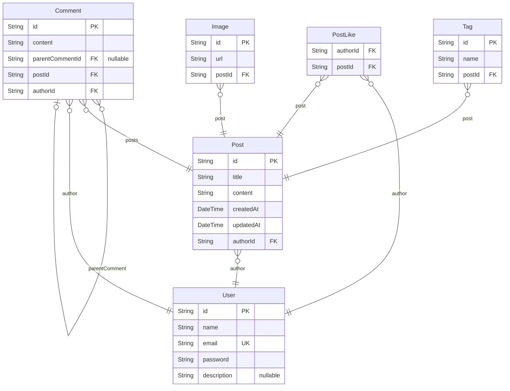

## API 명세서

| 구분        | 기능명           | HTTP Method | REST API                   | JWT |
| --------- | ------------- | ----------- | -------------------------- | --- |
| 1. 회원 관리  | 1.1 이메일 가입    | POST        | /auth/register             | X   |
|           | 1.2 로그인       | POST        | /auth/login                | X   |
|           | 1.3 로그인 갱신    | POST        | /auth/refresh              | X   |
|           | 1.4 로그아웃      | GET         | /auth/logout               | X   |
| 2. 게시글 관리 | 2.1 게시글 목록 조회 | GET         | /posts?search=&page=&limit | X   |
|           | 2.2 게시글 상세 조회 | GET         | /posts/:id                 | X   |
|           | 2.3 게시글 등록    | POST        | /posts                     | O   |
|           | 2.4 게시글 수정    | PATCH       | /posts/:id                 | O   |
|           | 2.5 게시글 삭제    | DELETE      | /posts/:id                 | O   |
|           | 2.6 게시글 좋아요   | POST        | /posts/like                | O   |
|           | 2.7 댓글 작성     | POST        | /posts/comments            | O   |
|           | 2.8 댓글 수정     | PATCH       | /posts/comments/:id        | O   |
|           | 2.9 댓글 삭제     | DELETE      | /posts/comments/:id        | O   |

# ERD 설계
> Generated by [`prisma-markdown`](https://github.com/samchon/prisma-markdown)

- [Board](#board)

## Board

### `User`
회원 테이블

**Properties**
- `id`: Pirmary Key
- `name`: 이름
- `email`: 이메일
- `password`: 비밀번호
- `description`: 간단한 소개

### `Post`
게시글 테이블

**Properties**
- `id`: Pirmary Key
- `title`: 제목
- `content`: 내용
- `createdAt`: 생성일
- `updatedAt`: 수정일
- `authorId`
  > Foreign Key
  >
  > 작성자 ID [User.id](#User)

### `Comment`
댓글 테이블

**Properties**
- `id`: Pirmary Key
- `content`: 내용
- `parentCommentId`
  > Foreign Key
  >
  > 부모 댓글 ID [Comment.id](#Comment)
- `postId`
  > Foreign Key
  >
  > 게시글 ID [Post.id](#Post)
- `authorId`
  > Foreign Key
  >
  > 작성자 ID [User.id](#User)

### `PostLike`
게시글 좋아요 테이블

**Properties**
- `authorId`
  > Foreign Key
  >
  > 작성자 ID
- `postId`
  > Foreign Key
  >
  > 게시글 ID [Post.id](#Post)

### `Tag`
게시글 태그 테이블

**Properties**
- `id`: Primary Key
- `name`: 태그 이름
- `postId`
  > Foreign Key
  >
  > 게시글 ID [Post.id](#Post)

### `Image`
게시글 이미지 테이블

**Properties**
- `id`: Pirmary Key
- `url`: 이미지 url
- `postId`
  > Foreign Key
  >
  > 게시글 ID [Post.id](#Post)
