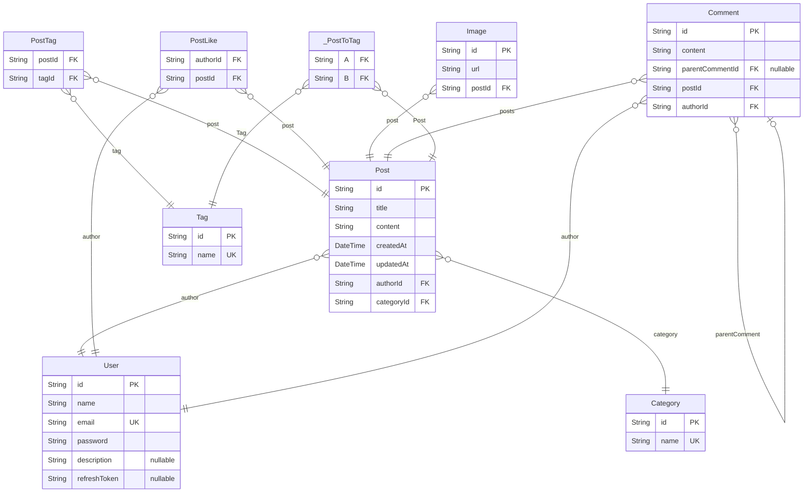

## ⚡ API 명세서

| 구분        | 기능명            | HTTP Method | REST API                   | JWT   |
|-----------|----------------|-------------|----------------------------|-------|
| 1. 회원 관리  | ~~1.1 이메일 가입~~ | ~~POST~~    | ~~/auth/register~~         | ~~X~~ |
|           | 1.2 로그인        | POST        | /auth/login                | X     |
|           | 1.3 로그인 갱신     | GET         | /auth/refresh              | O     |
|           | 1.4 로그아웃       | GET         | /auth/logout               | O     |
| 2. 게시글 관리 | 2.1 게시글 목록 조회  | GET         | /posts?search=&page=&limit | X     |
|           | 2.2 게시글 상세 조회  | GET         | /posts/:id                 | X     |
|           | 2.3 게시글 등록     | POST        | /posts                     | O     |
|           | 2.4 게시글 수정     | PATCH       | /posts/:id                 | O     |
|           | 2.5 게시글 삭제     | DELETE      | /posts/:id                 | O     |
|           | 2.6 카테고리 목록 조회 | GET         | /posts/category            | O     |
|           | 2.7 카테고리 상세 조회 | GET         | /posts/category/:id        | O     |
|           | 2.8 카테고리 생성    | POST        | /posts/category            | O     |
|           | 2.9 카테고리 수정    | PATCH       | /posts/category/:id        | O     |
|           | 2.10 카테고리 삭제   | DELETE      | /posts/category/:id        | O     |
|           | 2.11 게시글 좋아요   | POST        | /posts/like                | X     |
|           | 2.12 댓글 작성     | POST        | /posts/comments            | X     |
|           | 2.13 대댓글 작성    | POST        | /posts/child-comments      | X     |
|           | 2.14 댓글 수정     | PATCH       | /posts/comments/:id        | X     |
|           | 2.15 댓글 삭제     | DELETE      | /posts/comments/:id        | X     |

## ⚡ ERD 설계

# 블로그 프로젝트 ERD

> Generated by [`prisma-markdown`](https://github.com/samchon/prisma-markdown)

- [Blog](#blog)

## Blog

### `User`

회원 테이블

**Properties**

- `id`: Pirmary Key
- `name`: 이름
- `email`: 이메일
- `password`: 비밀번호
- `description`: 간단한 소개
- `refreshToken`: refresh token

### `Post`

게시글 테이블

**Properties**

- `id`: Pirmary Key
- `title`: 제목
- `content`: 내용
- `createdAt`: 생성일
- `updatedAt`: 수정일
- `authorId`
  > Foreign Key
  >
  > 작성자 ID [User.id](#User)
- `categoryId`
  > Foreign Key
  >
  > 작성자 ID [Category.id](#Category)

### `Tag`

태그 테이블

**Properties**

- `id`: Primary Key
- `name`: 태그 이름

### `PostTag`

포스트, 태그 다대다 테이블

**Properties**

- `postId`
  > Foreign Key
  >
  > 게시글 ID [Post.id](#Post)
- `tagId`
  > Foreign Key
  >
  > 태그 ID [Tag.id](#Tag)

### `PostLike`

회원, 게시글 좋아요 다대다 테이블

**Properties**

- `authorId`
  > Foreign Key
  >
  > 작성자 ID [User.id](#User)
- `postId`
  > Foreign Key
  >
  > 게시글 ID [Post.id](#Post)

### `Image`

이미지 테이블

**Properties**

- `id`: Pirmary Key
- `url`: 이미지 url
- `postId`
  > Foreign Key
  >
  > 게시글 ID [Post.id](#Post)

### `Comment`

댓글 테이블

**Properties**

- `id`: Pirmary Key
- `content`: 내용
- `parentCommentId`
  > Foreign Key
  >
  > 부모 댓글 ID [Comment.id](#Comment)
- `postId`
  > Foreign Key
  >
  > 게시글 ID [Post.id](#Post)
- `authorId`
  > Foreign Key
  >
  > 작성자 ID [User.id](#User)

### `Category`

카테고리 테이블

**Properties**

- `id`: Primary Key
- `name`: 카테고리 이름

### `_PostToTag`

Pair relationship table between [Post](#Post) and [Tag](#Tag)

**Properties**

- `A`:
- `B`: 
